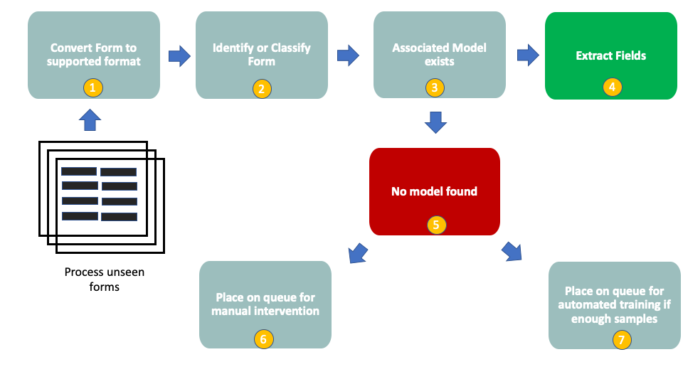

# Classifying forms

[Using Form Recognizer to classify forms](FormRecClassification.md)

## Options to classify forms

Broadly speaking, there are two approaches that may be adopted to classify forms, namely:

* **Computer Vision**: Identify and extract image features from the scanned image that can be used to train a model to identify the form. This could be a logo or a representation of the form layout, if it is unique enough and distinguishable across the dataset.
* **Text based**: Identify and extract text features from the OCR'd image that can be used to either train a model or searched against.

When dealing with large amount of different form layouts, this can be quite complex to implement and maintain. Approaches also need to be included to apply to layouts that change and indeed to new forms that are introduced to the process.

**A simple and maintainable option is to use a text based search approach.** This implies performing an initial OCR read against the form to extract the text, and then to use simple search techniques to search for identifiable and distingiushable attributes, from a datastore for example, to identify and route the form to the associated model for _data field extraction_. A ranking based approach with boosting and scoring may be applied to improve classification accuracy.

The image below illustrates the flow at a high level:

* Step 1 - Here we convert our forms to a supported format if needed.  
* Step 2 - We now classify the forms using an approach that can reliably and accurately extract distinguishable features.  
* Step 3 - We check our model store lookup (See the Pipelines section) to determine whether a model exists for our identified form
* Step 4 - We can now extract the fields from our model
* Step 5 - In the event that no model exists this implies that we either have misclassified the form, or the layout has changed or this is a new layout or form type.  We need to add this as part of our human feedback loop. 
* Step 6 - We can either place this on a queue for human intervention where the form can be inspected and any corrections made
* Step 7 - In the event that this represents a new layout or a changed layout, we can automate the collection of samples of this new/changed layout and automatically train a new model.  This is a stretch goal, implemented over time and usually cannot be done for an MVP.  

## Classification Approaches/Hypotheses

These are in no particular order.  I give a status wherever I've tested an approach.  

## Approach 1:  Text-Based Approach Using Attribute Searching

*Status:  started the code, see below*

* this is not really ML
* [An Example](attribute_search.py)
  * implements attribute-based search with ranking, boosting, and scoring

### How does it work?  

* We create a lookup datastore or table that contains the form layout unique id, e.g. Invoice vendor, Form Type Name etc alongside the distinguishable features that we can use to search for. We can also consider adding weightings to these features.
* We OCR the form if we have not done so already so that we can extract the text features
* We now search the OCR for the form line by line for each of the attributes using a variety of techniques including, regex, partial and complete word fuzzy matching
* If we find the attributes we create table with our respective candidates and the score the results.
* Upon completion of the score, we rank and select and return the best candidate

## Approach 2: Clustering using text features

*Status:  started the code, see below*

Will semi-automatically discover and annotate layout types for different forms in document images

### How does it work?

* extract the text of the document using your OCR software
* process and clean the extracted text using regex and fuzzy matchin/filtering based on words vocabulary
* Use TFIDF vectorizer with N-grams to generate feature vectors representing each document
* Apply density-based clustering on those features to extract groups of document images with similar forms layout types

### Implementation

* [vocabulary.txt](./clustering/vocabulary.txt) 
  * this is the set of important words we should look for
  * **Unfortunately, this step probably requires the most time and is a drawback to this solution**
  * Why do we need this?  We need to ensure we don't get hung up on Proper Nouns and other noise that will skew the results.
* [layout-clustering-and-labeling.ipynb](./clustering/layout-clustering-and-labeling.ipynb)

## Approach 3:  Named Entity Recognition

*Status:  started the code, see below*

* this isn't meant specifically for classification, but the concepts carry-over
* NER is the task of detecting and classifying real-world objects mentioned in text.  NEs include person names, location, organizations, etc.  
* methods include LSTM neural nets (RNNs) and pretrained language models like BERT
* NER usually involves assigning an entity label to each word in a sentence.  
  * this obviously requires some work
  * entities can be labeled and assigned into facets (not an entity, location, organization, form type, person)
  * [Common Labeling Schemes](http://cs229.stanford.edu/proj2005/KrishnanGanapathy-NamedEntityRecognition.pdf)
* BERT:  Bidirectional Encoder Representations from Transformers
* [Example classifier using BERT](./bert/ner_wikigold_transformer.ipynb)
* [Microsoft solution accelerator](https://github.com/microsoft/Accelerator-AzureML_CognitiveSearch)

## Approach 4:  Text Classification using BERT

https://github.com/microsoft/nlp-recipes/tree/master/examples/text_classification
* try Approach 11 first using automl to save time and determine viability

## Approach 5:  Deep Learning:  GloVe word embeddings

https://github.com/microsoft/MCW-Cognitive-services-and-deep-learning/blob/master/Hands-on%20lab/notebooks/00%20Init.ipynb

https://github.com/microsoft/MCW-Cognitive-services-and-deep-learning/blob/master/Hands-on%20lab/notebooks/03%20Claim%20Classification.ipynb

## Approach 6:  ML: Naive Bayes Classifier

https://textblob.readthedocs.io/en/dev/classifiers.html

## Approach 7:  ML: Logistic/Linear Regression

* should work better than Naive Bayes if there is enough data to train on
* look for statistical relationships between inpout phrases and outputs

## Approach 8:  Facebook's open-source fastText

* https://fasttext.cc/
* converts text into continuous vectors.
* uses a hashtable for word or character ngrams (which will likely work better for JSON, which really isn't natural language)
* one benefit:  produces vectors for any words, even made-up words.  This helps with the JSON.  

## Approach 9:  Vowpal Wabbit

* open source and very similar to fastText

## Approach 10:  Bag-of-words and tf*idf models

* in these model a document is represented as the "bag" of its words, disregarding grammar and word order but focusing on multiplicity.  For classification this works by looking at the frequency of each word and using that as a feature. 
* from there I can look at how many times a word or "term" occurs (term frequency: tf) in the document and that should help with classification.  
* but, having a high tf does not necessarily mean that the corresponding term is more important.  So we weight the term by the "inverse document frequency" (idf) (basically, how many times does the word show up in all documents)
* does not take word order/term order into account 

## Approach 11:  Azure Machine Learning Service automl with BERT

* automl has a huge BERT model which should be a good start to see if BERT is even viable without cleaning up the JSON text first.  
* should be more accurate than BoW and Microsoft believes this might be best, especially with smaller training sets
* BERT needs fine tuning on Guard's corpus otherwise the results won't be great.  automl accomplishes this.
* will need Standard NC6 vm likely  
* [An Example](https://github.com/davew-msft/MLOps-E2E/blob/master/jupyter-notebooks/Deep%20Learning%20with%20Text.ipynb)
* [Version started for customer](./automl-bert/text-classification.ipynb)
* Notes
  * https://github.com/microsoft/bert-stack-overflow/blob/master/1-Training/spark/stackoverflow-data-prep.ipynb
  * https://github.com/microsoft/bert-stack-overflow/blob/master/1-Training/AzureServiceClassifier_Training.ipynb
  * https://github.com/Azure/MachineLearningNotebooks/blob/master/how-to-use-azureml/automated-machine-learning/classification-text-dnn/auto-ml-classification-text-dnn.ipynb
  * https://github.com/Microsoft/AzureML-BERT
## Other Links

* [Forms Recipes](https://github.com/microsoft/knowledge-extraction-recipes-formsj)
